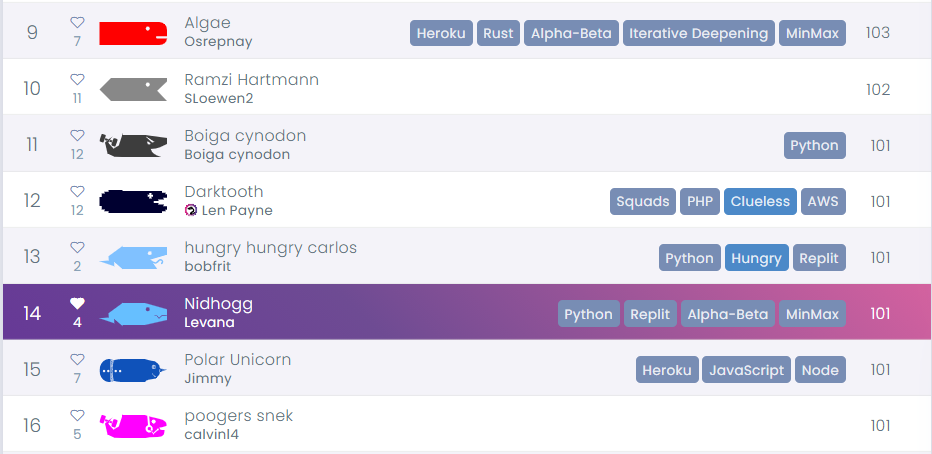
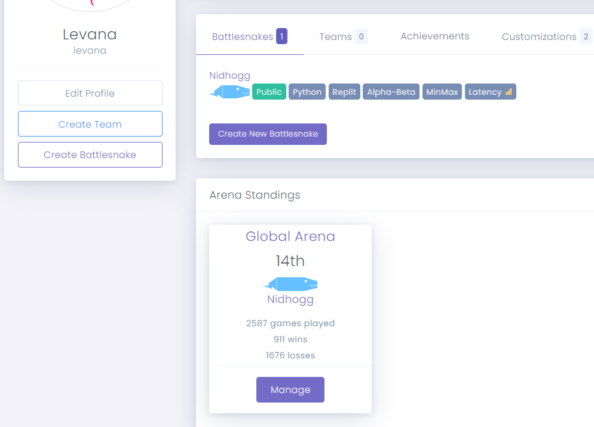

# Nidhogg
AI Snake for BattleSnake Tournament April 2021

## Algorithm
1. Calculation of distance: BFS Floodfill
2. Main game strategy: Minimax with Alpha-Beta Pruning
3. Hashing Algorithm:  Zobrist Hashing for the state of the board

## Heuristics
1. Assign infinite scores to dead position or health = 0
2. High score to the direction that causes the death of a rival
3. High score to open area (space = get-distance(my-position))
4. High score if me.health = max(rival.health) + 1
5. Weighted score based on the distance to the food
6. If same score, choose the closest position to the center of the board

The implementation of the Minimax class is being refactored. **The original implementation ranks 14th at the global arena.**

|||
|-----|-----|
| | |
